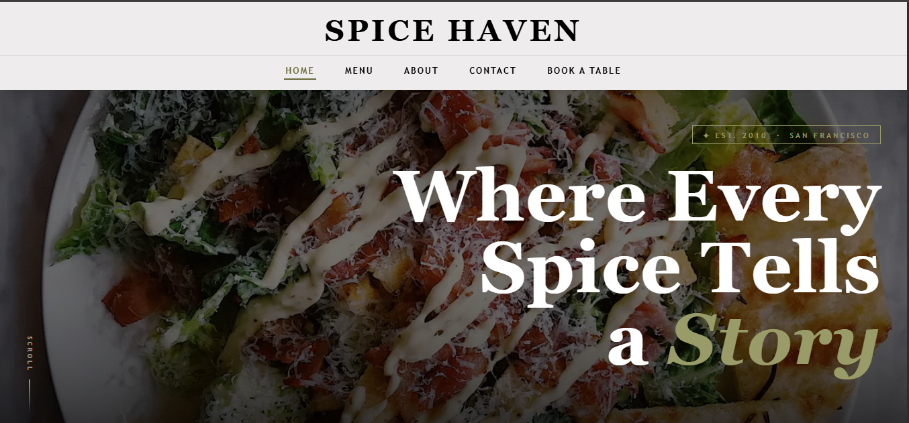

# SpiceHaven 🍽️

SpiceHaven is a modern and responsive restaurant website template designed for cafes, restaurants, and food businesses. The project focuses on clean UI, elegant design, and smooth user experience across all devices.

---

# 🌐 Live Demo

🔗 https://spice-haven-two.vercel.app/

---

# 📸 Homepage Preview



---

# 🚀 Features

- Fully Responsive Design
- Modern Restaurant UI
- Interactive Hero Section
- Food Menu Showcase
- About Us Section
- Table Booking Form
- Smooth Navigation
- Clean & Organized Code
- Mobile Friendly Layout
- Attractive Animations

---

# 🛠️ Technologies Used

- HTML5
- CSS3
- JavaScript

---

# 📂 Project Structure

```bash
SpiceHaven/
│
├── css/
├── js/
├── images/
├── index.html
├── about.html
├── menu.html
├── book-a-table.html
└── README.md
```

---

# 📥 Installation

### 1️⃣ Clone Repository

```bash
git clone https://github.com/Rabina-Vishwakarma/SpiceHaven.git
```

### 2️⃣ Open Project Folder

```bash
cd SpiceHaven
```

### 3️⃣ Run Project

Open `index.html` in browser.

---

# 👩‍💻 Author

## Rabina Vishwakarma

- GitHub: https://github.com/Rabina-Vishwakarma
  

---

# 📄 License

This project is open-source and free to use.
